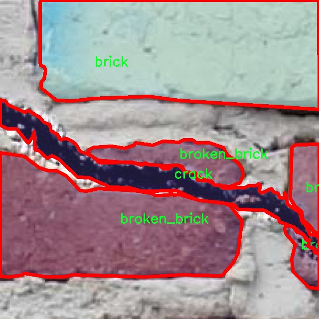

# 砖石结构缺陷分割系统源码＆数据集分享
 [yolov8-seg-C2f-MSBlock＆yolov8-seg-repvit等50+全套改进创新点发刊_一键训练教程_Web前端展示]

### 1.研究背景与意义

项目参考[ILSVRC ImageNet Large Scale Visual Recognition Challenge](https://gitee.com/YOLOv8_YOLOv11_Segmentation_Studio/projects)

项目来源[AAAI Global Al lnnovation Contest](https://kdocs.cn/l/cszuIiCKVNis)

研究背景与意义

随着城市化进程的加快，砖石结构作为一种重要的建筑材料，广泛应用于各类建筑物中。然而，砖石结构在长期使用过程中，容易受到环境因素、荷载变化及材料老化等多重影响，导致结构缺陷的产生。这些缺陷不仅影响建筑物的美观，更严重的是可能威胁到建筑的安全性和使用寿命。因此，及时、准确地检测和评估砖石结构的缺陷，成为了建筑工程领域亟待解决的重要问题。

传统的砖石结构缺陷检测方法主要依赖人工目测和简单的工具检测，这种方法不仅效率低下，而且容易受到人为因素的影响，导致漏检和误检现象的发生。随着计算机视觉技术的快速发展，基于深度学习的图像处理方法逐渐成为砖石结构缺陷检测的新趋势。YOLO（You Only Look Once）系列模型因其高效的实时检测能力，已被广泛应用于目标检测和分割任务中。然而，现有的YOLOv8模型在处理砖石结构缺陷时，仍存在一定的局限性，如对小目标的检测精度不足、对复杂背景的适应性差等问题。因此，改进YOLOv8模型，以提高其在砖石结构缺陷分割中的性能，具有重要的研究意义。

本研究将基于改进的YOLOv8模型，构建一个砖石结构缺陷分割系统。该系统将利用一个包含1300张图像的数据集，数据集中包含三类目标：砖块、破损砖块和裂缝。这些数据不仅涵盖了不同类型的砖石结构缺陷，还包括多种环境条件下的图像，能够为模型的训练和测试提供丰富的样本支持。通过对这些数据的深入分析与处理，我们期望能够提升模型对砖石结构缺陷的识别能力，尤其是在复杂背景和小目标检测方面的表现。

本研究的意义不仅在于技术上的创新，更在于为建筑行业提供一种高效、智能的缺陷检测解决方案。通过自动化的缺陷检测系统，能够大幅提高检测效率，降低人工成本，减少人为错误，从而为建筑物的安全性和耐久性提供有力保障。此外，改进后的YOLOv8模型在砖石结构缺陷检测中的应用，能够为其他领域的图像分割任务提供借鉴，推动计算机视觉技术在更广泛的应用场景中的发展。

综上所述，基于改进YOLOv8的砖石结构缺陷分割系统的研究，不仅具有重要的理论价值，也具有广泛的实际应用前景。通过本研究，我们希望能够为砖石结构的维护与管理提供科学依据，促进建筑行业的可持续发展，同时推动深度学习技术在工程领域的深入应用。

### 2.图片演示


##### 注意：由于此博客编辑较早，上面“2.图片演示”和“3.视频演示”展示的系统图片或者视频可能为老版本，新版本在老版本的基础上升级如下：（实际效果以升级的新版本为准）

  （1）适配了YOLOV8的“目标检测”模型和“实例分割”模型，通过加载相应的权重（.pt）文件即可自适应加载模型。

  （2）支持“图片识别”、“视频识别”、“摄像头实时识别”三种识别模式。

  （3）支持“图片识别”、“视频识别”、“摄像头实时识别”三种识别结果保存导出，解决手动导出（容易卡顿出现爆内存）存在的问题，识别完自动保存结果并导出到tempDir中。

  （4）支持Web前端系统中的标题、背景图等自定义修改，后面提供修改教程。

  另外本项目提供训练的数据集和训练教程,暂不提供权重文件（best.pt）,需要您按照教程进行训练后实现图片演示和Web前端界面演示的效果。

### 3.视频演示

[3.1 视频演示](https://www.bilibili.com/video/BV1ZDyVYHE4J/)

### 4.数据集信息展示

##### 4.1 本项目数据集详细数据（类别数＆类别名）

nc: 3
names: ['brick', 'broken_brick', 'crack']


##### 4.2 本项目数据集信息介绍

数据集信息展示

在构建高效的砖石结构缺陷分割系统的过程中，数据集的选择与构建至关重要。本研究所采用的数据集名为“masonry”，其设计旨在支持对砖石结构中常见缺陷的精确识别与分割。该数据集包含三种主要类别，分别是“brick”（砖块）、“broken_brick”（破损砖块）和“crack”（裂缝），这些类别的设置不仅反映了砖石结构的常见缺陷类型，也为后续的模型训练提供了丰富的样本支持。

“masonry”数据集的构建过程中，特别注重样本的多样性与代表性。每一类别的样本均来自于不同的建筑环境和使用场景，以确保模型在实际应用中的泛化能力。例如，在“brick”类别中，样本涵盖了不同颜色、形状和尺寸的砖块，这些砖块可能在不同的光照条件下被拍摄，旨在模拟真实世界中砖石结构的多样性。而在“broken_brick”类别中，数据集收录了多种破损形式的砖块，包括缺角、裂纹及剥落等情况，这些样本的多样性有助于模型学习到如何识别不同程度的破损。最后，在“crack”类别中，数据集则集中于各种类型的裂缝，既包括细小的表面裂缝，也包括较大、较深的结构性裂缝，以确保模型能够准确捕捉到裂缝的特征。

为了提高数据集的实用性和有效性，数据集中的每个样本都经过精心标注，确保标注的准确性和一致性。标注过程中，采用了先进的图像标注工具，确保每个缺陷的边界清晰可见，便于后续的模型训练与评估。此外，数据集还包含了多种环境条件下的样本，如不同的天气、光照和背景，这些因素都可能影响砖石结构缺陷的可见性和识别难度。因此，数据集的设计充分考虑了这些实际应用中的变量，以增强模型的鲁棒性。

在训练改进YOLOv8-seg模型时，数据集“masonry”将作为基础数据源，支持模型对砖石结构缺陷的自动检测与分割。通过使用这一数据集，研究团队期望模型能够在多种实际场景中表现出色，具备高准确率和高召回率，从而为砖石结构的维护与管理提供有效的技术支持。最终，经过多轮训练与优化，期望构建出一个能够实时、准确识别砖石结构缺陷的智能系统，推动建筑行业的智能化发展。

综上所述，“masonry”数据集不仅在类别设置上覆盖了砖石结构中常见的缺陷类型，而且在样本的多样性、标注的准确性及环境的多样性等方面均进行了全面考虑。这些因素共同构成了一个高质量的数据集，为改进YOLOv8-seg模型的训练奠定了坚实的基础。通过这一数据集的有效应用，研究团队希望能够实现砖石结构缺陷的高效识别与分割，为建筑物的安全性和耐久性提供保障。




### 5.全套项目环境部署视频教程（零基础手把手教学）

[5.1 环境部署教程链接（零基础手把手教学）](https://www.bilibili.com/video/BV1jG4Ve4E9t/?vd_source=bc9aec86d164b67a7004b996143742dc)


[5.2 安装Python虚拟环境创建和依赖库安装视频教程链接（零基础手把手教学）](https://www.bilibili.com/video/BV1nA4VeYEze/?vd_source=bc9aec86d164b67a7004b996143742dc)

### 6.手把手YOLOV8-seg训练视频教程（零基础小白有手就能学会）

[6.1 手把手YOLOV8-seg训练视频教程（零基础小白有手就能学会）](https://www.bilibili.com/video/BV1cA4VeYETe/?vd_source=bc9aec86d164b67a7004b996143742dc)


按照上面的训练视频教程链接加载项目提供的数据集，运行train.py即可开始训练



     Epoch   gpu_mem       box       obj       cls    labels  img_size
     1/200     0G   0.01576   0.01955  0.007536        22      1280: 100%|██████████| 849/849 [14:42<00:00,  1.04s/it]
               Class     Images     Labels          P          R     mAP@.5 mAP@.5:.95: 100%|██████████| 213/213 [01:14<00:00,  2.87it/s]
                 all       3395      17314      0.994      0.957      0.0957      0.0843

     Epoch   gpu_mem       box       obj       cls    labels  img_size
     2/200     0G   0.01578   0.01923  0.007006        22      1280: 100%|██████████| 849/849 [14:44<00:00,  1.04s/it]
               Class     Images     Labels          P          R     mAP@.5 mAP@.5:.95: 100%|██████████| 213/213 [01:12<00:00,  2.95it/s]
                 all       3395      17314      0.996      0.956      0.0957      0.0845

     Epoch   gpu_mem       box       obj       cls    labels  img_size
     3/200     0G   0.01561    0.0191  0.006895        27      1280: 100%|██████████| 849/849 [10:56<00:00,  1.29it/s]
               Class     Images     Labels          P          R     mAP@.5 mAP@.5:.95: 100%|███████   | 187/213 [00:52<00:00,  4.04it/s]
                 all       3395      17314      0.996      0.957      0.0957      0.0845


### 7.50+种全套YOLOV8-seg创新点代码加载调参视频教程（一键加载写好的改进模型的配置文件）

[7.1 50+种全套YOLOV8-seg创新点代码加载调参视频教程（一键加载写好的改进模型的配置文件）](https://www.bilibili.com/video/BV1Hw4VePEXv/?vd_source=bc9aec86d164b67a7004b996143742dc)

### 8.YOLOV8-seg图像分割算法原理

原始YOLOV8-seg算法原理

YOLOV8-seg算法是YOLO系列目标检测算法的最新版本，旨在通过高效的图像分割和目标检测技术，为计算机视觉领域提供更为精准和快速的解决方案。YOLO（You Only Look Once）系列算法自诞生以来，便以其独特的单阶段检测架构和优越的性能而广受欢迎。YOLOV8作为该系列的最新进化版本，在多个方面进行了显著的改进和优化，尤其是在分割任务的处理上。

YOLOV8-seg的核心架构由四个主要部分组成：输入层、Backbone骨干网络、Neck特征融合网络和Head检测模块。输入层负责对输入图像进行预处理，包括图像尺寸调整、Mosaic增强和瞄点计算等操作。Mosaic增强技术通过将多张图像随机拼接成一张新图像，极大地丰富了训练样本的多样性，从而提高了模型的泛化能力和检测精度。

在Backbone部分，YOLOV8-seg采用了C2f模块替代了传统的C3模块。C2f模块通过引入更多的分支来增强梯度流动，使得特征提取更加高效。这种设计不仅保留了轻量级特性，还有效地提升了模型在不同尺度目标检测中的表现。通过SPPF模块的应用，YOLOV8-seg能够对输出特征图进行处理，利用不同内核尺寸的池化操作合并特征图，从而获得更为丰富的特征信息。

Neck部分的设计依然采用了双塔结构，即特征金字塔网络（FPN）与路径聚合网络（PAN）的结合。这种结构有效促进了语义特征与定位特征之间的转移，使得模型在处理多尺度目标时，能够更好地融合不同层次的特征信息。通过这种特征融合，YOLOV8-seg在目标检测的准确性和速度上均有显著提升。

在Head模块中，YOLOV8-seg采用了解耦头（Decoupled Head）结构，将分类和定位任务分开处理。与传统的耦合头结构不同，解耦头通过两个独立的分支分别进行类别预测和边界框回归。这种设计不仅加速了模型的收敛速度，还提高了检测精度。YOLOV8-seg在损失函数的设计上也进行了创新，采用了分布焦点损失（DFL）和CIoU损失的组合，以增强模型对标签附近数值的聚焦能力，从而提升检测性能。

值得注意的是，YOLOV8-seg在标签分配策略上进行了重要的改进。不同于以往的基于锚框的策略，YOLOV8-seg采用了无锚框（Anchor-Free）的方法，将目标检测转化为关键点检测。这一创新使得模型在处理不同尺寸和形状的目标时，能够更加灵活且高效地进行检测，减少了计算复杂度，并提升了模型的泛化能力。

YOLOV8-seg的优势不仅体现在其高效的网络结构上，还包括其在多种数据集上的出色表现。通过在COCOval2017数据集上的测试，YOLOV8-seg展示了其在单模型单尺度测试中的优越性能。这使得YOLOV8-seg成为目标检测、图像分割和图像分类等任务的理想选择。

综上所述，YOLOV8-seg算法在YOLO系列的基础上，通过对网络结构的优化、特征融合的加强以及标签分配策略的创新，极大地提升了目标检测和图像分割的性能。其独特的设计理念和高效的实现方式，使得YOLOV8-seg在计算机视觉领域中展现出强大的应用潜力，成为未来研究和应用的重要方向。


### 9.系统功能展示（检测对象为举例，实际内容以本项目数据集为准）

图9.1.系统支持检测结果表格显示

  图9.2.系统支持置信度和IOU阈值手动调节

  图9.3.系统支持自定义加载权重文件best.pt(需要你通过步骤5中训练获得)

  图9.4.系统支持摄像头实时识别

  图9.5.系统支持图片识别

  图9.6.系统支持视频识别

  图9.7.系统支持识别结果文件自动保存

  图9.8.系统支持Excel导出检测结果数据


### 10.50+种全套YOLOV8-seg创新点原理讲解（非科班也可以轻松写刊发刊，V11版本正在科研待更新）

#### 10.1 由于篇幅限制，每个创新点的具体原理讲解就不一一展开，具体见下列网址中的创新点对应子项目的技术原理博客网址【Blog】：


[10.1 50+种全套YOLOV8-seg创新点原理讲解链接](https://gitee.com/qunmasj/good)

#### 10.2 部分改进模块原理讲解(完整的改进原理见上图和技术博客链接)【如果此小节的图加载失败可以通过CSDN或者Github搜索该博客的标题访问原始博客，原始博客图片显示正常】
### YOLOv8简介
在各种目标检测算法中，YOLO系列因其速度和准确度间的优异平衡脱颖而出，能够准确、快速的识别目标，便于部署到各种移动设备中，已经广泛应用于各种领域的目标检测、跟踪和分割。目前最新版本 YOLOv8由原v5的开发团队Ultralytics于2023年1月提出，按规格大小可划分为n、s、m、1和x5个版本，是目前最先进的目标检测算法，有着优异的性能，很适合用于无人机航拍图像目标检测。其网络结构如图所示。

YOLOv8模型包括Input、Backbone、Neck 和Head4部分。其中 Input选用了Mosaic数据增强方法，并且对于不同大小的模型，有部分超参数会进行修改，典型的如大模型会开启 MixUp 和CopyPaste数据增强，能够丰富数据集，提升模型的泛化能力和鲁棒性。Backbone主要用于提取图片中的信息，提供给Neck和Head使用，由多个Conv、C2f模块和尾部的SPPF组成。Conv模块由单个Conv2d、
BatchNorm2d和激活函数构成,用丁是双行在万E5特征图;YOLOv8参考了C3模块的残左绒以心YOLOv7[16l的ELAN思想，设计出了C2f 结构，可以在保证轻量化的同时获得更加丰富的梯度流信息，并根据模型尺度来调整通道数，大幅提升了模型性能;SPPF是空间金字塔池化，能够融合不同尺度的特征。Neck部分主要起特征融合的作用，充分利用了骨干网络提取的特征，采用FPN[17]+PAN[18〕结构，
能够增强多个尺度上的语义表达和定位能力。Head输出端根据前两部分处理得到的特征来获取检测目标的类别和位置信息，做出识别,换以小旦公来和定解耦头结构,将分类和检测头分:9w‘无锅框的位关注侧重点不同的问题，同时也采用了无锚框的目标检测（Anchor-Free)，能够提升检测速度。Loss计算方面采用了正负样本动态分配策略，使用 VFLLoss 作为分类损失，使用DFLLoss+CIOU Loss作为回归损失。

### AutoFocus: Efficient Multi-Scale Conv简介

参考该博客提出了AutoFocus，一种高效的多尺度目标检测算法。相较于以前对整个图像金字塔进行处理，该方法以一种由表及里的姿态，仅处理哪些整体上看来很有可能存在小物体的区域。这个可以通过预测一张类别未知的分割图FocusPixels来得到。为了高效利用FocusPixels，另外一个算法用于产生包含FocusPixels的FocusChips，这样可以减少计算量并处理更更精细的尺度。在不同尺度上FocusChips所得到的检测结果综合时，会出现问题，我们也提供了解决问题的方案。AutoFocus在COCO上的结果有49.7%mAP（50%重叠下68.3%），与多尺度baseline相仿但是快了2.5倍。金字塔中处理的像素数量减少了5倍mAP只下降1%，在与RetinaNet采用相同的ResNet-101结构且速度相同时，高了10%mAP。

人类寻找物体是一个动态的过程，且寻找时间与场景的复杂度是直接相关的。当我们的眼神在不同的点之间漂移时，其他的区域会被我们有意忽视。然而，现在的检测算法是一种静态的推理过程且图像金字塔中的每个像素都受到了一样的对待，这使得过程变得没有效率。现在许多的应用都不强调实时性，而计算上的节省其实可以产生很大收益。

在COCO数据集中，虽然40%的物体都是小物体，但是它们一共只占了全图的0.3%。如果金字塔是3倍关系，则在高分辨率层要进行9倍的运算。XXX 。那么有没有办法在低分辨率下找出可能含有这些物体的区域呢？

以人眼方案类比，我们可以从低分辨率图像开始，找出有可能存在物体的区域再“聚集”到高分辨率。我们的AutoFocus会在一层中计算小物体的分割图FocusPixels，而在每一个FocusPixels上会用一个算法产生下一层所需要关注的chips。在COCO的最大分辨率层上我们可以只处理**20%的像素而性能不下降，如果只处理5%**也只下降1%而已。


图像金字塔与卷积神经网络对CV十分重要。然而卷积神经网络无法做到对尺度不敏感，所以为了不同大小的物体需要依赖图像金字塔。虽然训练已经有了高效的方法，但是其推断时间依然远离实际使用标准。

目标检测加速有很长历史了。常用的有特征近似以减少尺度、级联、特征金字塔，且最后一个最近很多人研究。

AutoFocus为速度与精度之间提供了一个平滑的折衷，指出可以在低分辨率下看出小物体的所在，从而节约计算。FocusPixels的计算较为容易。

先简单介绍一下SNIP，是一种多尺度的训练、推断算法。主要思想是训练针对某个特定scale的检测器而不是scale-invariant检测器。这样训练样本就局限于在某个尺度范围内，以适于这个检测器处理。比如在高分辨率仅处理小物体而高分辨率仅处理大物体，其优势在于训练时不用考虑尺度的变化。

由于训练时物体大小是已知的，我们在图像金字塔中可以忽略大量区域而只处理物体周围的区域。SNIPER说明这样低分辨率的训练与全图训练相比并不会降低性能。同样，在推断过程中如果可以在大分辨率图像上预测可能出现小物体的chip，我们也就不用处理整张高分辨率图片。在训练时，许多物体会被裁剪、扭曲，这可以当作是一种数据扩增，然而当这个情况在推断时出现，则会产生错误，所以我们还需要一个算法来整合不同尺度上的检测结果。

#### AutoFocus框架
如SIFT、SURF等传统分类特征包含两个组件，一个detector和一个descriptor。detector只包含轻量级的操作如DoG、LoG，用于在整张图片上找到感兴趣的区域；descriptor，一般来说计算量比较大，则只需要关注那些咸兴趣的区域。这个级联结构保障了图片处理的效率。

同样，AutoFocus框架也是用于预测感兴趣的区域，并丢弃在下一尺度不可能存在物体的区域，并将裁剪和缩放后的区域传递给下一尺度。AutoFocus由三个部分组成：FocusPixels，FocusChips和focus stacking。

#### FocusPixels
FocusPixels定义在卷积网络特征图的粒度之上（如conv5），如果特征图上某个像素与小物体有重叠则标注为一个FocusPixel。（小物体：面积处于一个网络的输入范围之内）。训练过程中，FocusPixels标注为正，某些与不在面积范围内的物体有重叠的像素标注为无效，其他像素标注为负。AutoFocus的训练目标是使在FocusPixels区域产生较大的激活值。

如果同时多个物体与同一像素重叠，优先给正标注。我们的网络输入是512x512，然后a,b,c取值分别是5,64,90。对于太大或太小的物体，我们认为当前尺度上没有足够人信息进行判断，所以会标定为无效。整个网络结构如下图。训练时加两层带ReLU的卷积(3x3和1x1)以及一个二分类softmax来预测FocusPixels。


#### FocusChip生成
推断过程中，我们标注输出概率大于阈值t的像素（这个参数可以控制加速比），得到一些连通域。对于每一个域，我们做一次膨胀使其包含一些有助于识别的周围信息，膨胀后相连的部分要合并。然后，我们生成一些包含连通域的chips（不同chips可能重叠，如有重叠则合并）。有些chip可能太小缺少必要信息，并使chip的大小变化很大，为了效率我们要求保证一个最小的chip size。算法流程如下：


#### 级联推断过程
我们的过程类似于图片金字塔的推断过程但是在过程中一步步去除不关注的图片区域。我们在最低分辨率上进行检测并生成chips，然后在这些chips再进行检测和生成chips。

#### Focus Stacking
这种级联分类器的一个问题是在chip边缘本来的大物体可能生成一些被剪裁的检测目标。在下一个尺度上，由于剪裁过了，所以会检测到小的、错误的正例False Positive。之前算法中的第二步膨胀其实就是为了保证没有物体会出现在chip的边缘。这样，当我们在局部图片chip的边缘检测到物体时，就可以把这个检测结果丢弃，即使其在SNIP的范围内。

也有一些物体在图片边缘的特殊情况。如果chip和图片共享一条边的话，我们会检查检测结果的其他边是否完全在里面，如果在，则保留它，否则丢弃。

在每一尺度得到有效检测结果后，我们可以将不同尺度上的结果进行整合，将这些结果映射到原图坐标系上。最后，非极大值抑制NMS用于聚集。网络结构如之前的图片所示。


### 11.项目核心源码讲解（再也不用担心看不懂代码逻辑）

#### 11.1 ultralytics\trackers\__init__.py

下面是对给定代码的逐行分析，并保留核心部分，同时添加详细的中文注释：

```python
# Ultralytics YOLO 🚀, AGPL-3.0 license

# 从当前包中导入 BOTSORT 类
from .bot_sort import BOTSORT

# 从当前包中导入 BYTETracker 类
from .byte_tracker import BYTETracker

# 从当前包中导入 register_tracker 函数
from .track import register_tracker

# 定义模块的公开接口，允许用户通过简单的方式导入这些类和函数
__all__ = 'register_tracker', 'BOTSORT', 'BYTETracker'  # 允许更简单的导入
```

### 代码分析与注释

1. **导入模块**：
   - `from .bot_sort import BOTSORT`：从当前包（即同一目录下）导入 `BOTSORT` 类，可能用于目标跟踪的算法。
   - `from .byte_tracker import BYTETracker`：从当前包导入 `BYTETracker` 类，可能是另一种目标跟踪的实现。
   - `from .track import register_tracker`：从当前包导入 `register_tracker` 函数，用于注册跟踪器。

2. **定义公开接口**：
   - `__all__ = 'register_tracker', 'BOTSORT', 'BYTETracker'`：这是一个特殊的变量，用于定义当使用 `from module import *` 时，哪些名称是可以被导入的。这里指定了 `register_tracker`、`BOTSORT` 和 `BYTETracker` 这三个名称，简化了用户的导入方式。

### 核心部分总结
这段代码的核心在于导入了目标跟踪相关的类和函数，并通过 `__all__` 定义了模块的公开接口，方便用户使用。

这个文件是Ultralytics YOLO项目中的一个初始化文件，通常用于定义包的公共接口。在这个文件中，首先有一个注释，说明了该项目的名称（Ultralytics YOLO）以及其使用的许可证类型（AGPL-3.0）。接下来，文件导入了三个模块：`BOTSORT`、`BYTETracker`和`register_tracker`。这些模块分别来自于同一目录下的`bot_sort`、`byte_tracker`和`track`文件。

`BOTSORT`和`BYTETracker`可能是实现不同跟踪算法的类或函数，而`register_tracker`则可能是一个用于注册跟踪器的函数。这些导入使得在其他文件中使用这些功能时更加方便。

最后，`__all__`变量被定义为一个包含字符串的元组，列出了可以通过`from module import *`语句导入的公共接口。这意味着当其他模块导入这个包时，只能访问`register_tracker`、`BOTSORT`和`BYTETracker`这三个名称，从而实现了对模块接口的控制和封装。

总的来说，这个文件的主要作用是组织和简化跟踪器相关功能的导入，使得用户在使用Ultralytics YOLO时能够更方便地访问这些功能。

#### 11.2 ui.py

以下是保留的核心代码部分，并附上详细的中文注释：

```python
import sys
import subprocess

def run_script(script_path):
    """
    使用当前 Python 环境运行指定的脚本。

    Args:
        script_path (str): 要运行的脚本路径

    Returns:
        None
    """
    # 获取当前 Python 解释器的路径
    python_path = sys.executable

    # 构建运行命令，使用 streamlit 运行指定的脚本
    command = f'"{python_path}" -m streamlit run "{script_path}"'

    # 执行命令
    result = subprocess.run(command, shell=True)
    # 检查命令执行结果，如果返回码不为0，则表示出错
    if result.returncode != 0:
        print("脚本运行出错。")

# 实例化并运行应用
if __name__ == "__main__":
    # 指定要运行的脚本路径
    script_path = "web.py"  # 这里可以直接指定脚本名称，假设在当前目录下

    # 调用函数运行脚本
    run_script(script_path)
```

### 注释说明：
1. **导入模块**：
   - `sys`：用于访问与 Python 解释器相关的变量和函数。
   - `subprocess`：用于执行外部命令。

2. **`run_script` 函数**：
   - 接收一个参数 `script_path`，表示要运行的 Python 脚本的路径。
   - 使用 `sys.executable` 获取当前 Python 解释器的路径，以确保在当前环境中运行脚本。
   - 构建一个命令字符串，使用 `streamlit` 运行指定的脚本。
   - 使用 `subprocess.run` 执行构建的命令，并检查返回码以判断脚本是否成功运行。

3. **主程序块**：
   - 通过 `if __name__ == "__main__":` 确保该代码块仅在直接运行脚本时执行。
   - 指定要运行的脚本路径（这里假设脚本在当前目录下）。
   - 调用 `run_script` 函数来执行指定的脚本。

这个程序文件名为 `ui.py`，主要功能是使用当前的 Python 环境来运行一个指定的脚本，具体是通过 Streamlit 框架来启动一个 Web 应用。

首先，程序导入了几个必要的模块，包括 `sys`、`os` 和 `subprocess`。其中，`sys` 模块用于访问与 Python 解释器相关的变量和函数，`os` 模块提供了与操作系统交互的功能，而 `subprocess` 模块则用于执行外部命令。

接着，程序从 `QtFusion.path` 模块中导入了 `abs_path` 函数，这个函数的作用是获取文件的绝对路径。

在 `run_script` 函数中，程序接受一个参数 `script_path`，这个参数是要运行的脚本的路径。函数首先获取当前 Python 解释器的路径，接着构建一个命令字符串，这个命令使用 Streamlit 框架来运行指定的脚本。命令的格式是 `"{python_path}" -m streamlit run "{script_path}"`，其中 `python_path` 是当前 Python 解释器的路径，`script_path` 是要运行的脚本的路径。

然后，程序使用 `subprocess.run` 方法来执行这个命令。这个方法会在一个新的 shell 中运行命令，并返回一个结果对象。通过检查 `result.returncode`，程序可以判断命令是否成功执行。如果返回码不为 0，表示脚本运行出错，程序会打印出相应的错误信息。

在文件的最后部分，程序通过 `if __name__ == "__main__":` 来判断当前模块是否是主程序。如果是主程序，它会指定要运行的脚本路径，这里是通过 `abs_path("web.py")` 获取 `web.py` 的绝对路径。最后，调用 `run_script` 函数来运行这个脚本。

总的来说，这个程序的主要目的是提供一个简单的接口，通过当前的 Python 环境来启动一个 Streamlit Web 应用，方便用户进行交互式数据展示和分析。

#### 11.3 ultralytics\models\fastsam\val.py

```python
# 导入必要的模块
from ultralytics.models.yolo.segment import SegmentationValidator
from ultralytics.utils.metrics import SegmentMetrics

class FastSAMValidator(SegmentationValidator):
    """
    自定义验证类，用于在Ultralytics YOLO框架中进行快速SAM（Segment Anything Model）分割。

    该类扩展了SegmentationValidator类，专门定制了快速SAM的验证过程。此类将任务设置为'分割'，
    并使用SegmentMetrics进行评估。此外，为了避免在验证过程中出现错误，禁用了绘图功能。
    """

    def __init__(self, dataloader=None, save_dir=None, pbar=None, args=None, _callbacks=None):
        """
        初始化FastSAMValidator类，将任务设置为'分割'，并将指标设置为SegmentMetrics。

        参数：
            dataloader (torch.utils.data.DataLoader): 用于验证的数据加载器。
            save_dir (Path, optional): 保存结果的目录。
            pbar (tqdm.tqdm): 用于显示进度的进度条。
            args (SimpleNamespace): 验证器的配置。
            _callbacks (dict): 用于存储各种回调函数的字典。

        注意：
            在此类中禁用了ConfusionMatrix和其他相关指标的绘图，以避免错误。
        """
        # 调用父类的初始化方法
        super().__init__(dataloader, save_dir, pbar, args, _callbacks)
        # 设置任务类型为'分割'
        self.args.task = 'segment'
        # 禁用绘图功能以避免错误
        self.args.plots = False  
        # 初始化分割指标
        self.metrics = SegmentMetrics(save_dir=self.save_dir, on_plot=self.on_plot)
``` 

### 代码核心部分说明：
1. **类定义**：`FastSAMValidator`类继承自`SegmentationValidator`，用于快速SAM分割的自定义验证。
2. **初始化方法**：在`__init__`方法中，设置了任务类型为'分割'，并禁用了绘图功能以避免错误，同时初始化了分割指标。

这个程序文件是一个用于快速分割模型（Fast SAM）的验证类，名为 `FastSAMValidator`，它继承自 `SegmentationValidator` 类，属于 Ultralytics YOLO 框架的一部分。该类的主要功能是定制化验证过程，以适应快速分割模型的需求。

在类的文档字符串中，说明了这个验证类的目的和特点。它将任务设置为“分割”，并使用 `SegmentMetrics` 进行评估。此外，为了避免在验证过程中出现错误，该类禁用了绘图功能。

在构造函数 `__init__` 中，类的初始化过程接受多个参数，包括数据加载器、结果保存目录、进度条、配置参数以及回调函数字典。构造函数首先调用父类的初始化方法，确保基类的所有设置都被正确初始化。接着，它将任务类型设置为“segment”，并禁用绘图功能，以避免在验证过程中可能出现的错误。最后，它实例化 `SegmentMetrics` 用于评估指标，并将保存目录传递给它。

总的来说，这个类的设计旨在为快速分割模型提供一个简化且专门化的验证流程，确保在评估时不会因绘图功能而引发问题。

#### 11.4 train.py

以下是经过简化并添加详细中文注释的核心代码部分：

```python
import os
import torch
import yaml
from ultralytics import YOLO  # 导入YOLO模型库

if __name__ == '__main__':  # 确保该模块被直接运行时才执行以下代码
    # 设置训练参数
    workers = 1  # 数据加载的工作进程数
    batch = 8  # 每个批次的样本数量
    device = "0" if torch.cuda.is_available() else "cpu"  # 检查是否有可用的GPU

    # 获取数据集配置文件的绝对路径
    data_path = abs_path(f'datasets/data/data.yaml', path_type='current')

    # 将路径格式转换为Unix风格
    unix_style_path = data_path.replace(os.sep, '/')
    # 获取数据集所在目录的路径
    directory_path = os.path.dirname(unix_style_path)

    # 读取YAML配置文件
    with open(data_path, 'r') as file:
        data = yaml.load(file, Loader=yaml.FullLoader)

    # 检查并修改数据集路径
    if 'train' in data and 'val' in data and 'test' in data:
        data['train'] = directory_path + '/train'  # 设置训练集路径
        data['val'] = directory_path + '/val'      # 设置验证集路径
        data['test'] = directory_path + '/test'    # 设置测试集路径

        # 将修改后的数据写回YAML文件
        with open(data_path, 'w') as file:
            yaml.safe_dump(data, file, sort_keys=False)

    # 加载YOLO模型配置和预训练权重
    model = YOLO(r"C:\codeseg\codenew\50+种YOLOv8算法改进源码大全和调试加载训练教程（非必要）\改进YOLOv8模型配置文件\yolov8-seg-C2f-Faster.yaml").load("./weights/yolov8s-seg.pt")

    # 开始训练模型
    results = model.train(
        data=data_path,  # 指定训练数据的配置文件路径
        device=device,  # 指定使用的设备（GPU或CPU）
        workers=workers,  # 数据加载的工作进程数
        imgsz=640,  # 输入图像的大小
        epochs=100,  # 训练的轮数
        batch=batch,  # 每个批次的样本数量
    )
```

### 代码说明：
1. **导入库**：导入必要的库，包括操作系统相关的`os`、深度学习框架`torch`、YAML文件处理库`yaml`和YOLO模型库。
2. **主程序入口**：使用`if __name__ == '__main__':`确保代码仅在直接运行时执行。
3. **设置训练参数**：定义数据加载的工作进程数、批次大小和设备（GPU或CPU）。
4. **获取数据集路径**：通过`abs_path`函数获取数据集配置文件的绝对路径，并转换为Unix风格路径。
5. **读取和修改YAML文件**：读取YAML文件，检查并修改训练、验证和测试集的路径，然后将修改后的内容写回文件。
6. **加载YOLO模型**：使用指定的配置文件和预训练权重加载YOLO模型。
7. **训练模型**：调用`model.train`方法开始训练，传入数据路径、设备、工作进程数、图像大小、训练轮数和批次大小等参数。

这个程序文件 `train.py` 是用于训练 YOLO（You Only Look Once）目标检测模型的脚本。首先，程序导入了必要的库，包括操作系统相关的 `os`、深度学习框架 `torch`、YAML 文件处理库 `yaml`、YOLO 模型库 `ultralytics` 和用于图形界面的 `matplotlib`。

在 `__main__` 块中，程序首先设置了一些训练参数，包括工作进程数 `workers`、批次大小 `batch` 和设备类型 `device`。设备类型会根据当前系统是否支持 CUDA 来选择，如果支持则使用 GPU（设备 "0"），否则使用 CPU。

接下来，程序构建了数据集配置文件的绝对路径，使用 `abs_path` 函数来获取 `datasets/data/data.yaml` 的路径。然后，程序将路径中的分隔符统一为 Unix 风格的斜杠 `/`，并提取出目录路径。

程序读取 YAML 文件中的内容，并将其解析为 Python 字典。接着，程序检查字典中是否包含 'train'、'val' 和 'test' 三个键，如果存在，则更新这些键对应的路径为当前目录下的相应子目录。更新完成后，程序将修改后的数据写回到 YAML 文件中，以保持数据集路径的正确性。

接下来，程序加载了 YOLO 模型的配置文件，并使用预训练的权重文件进行初始化。这里的模型配置文件是 `yolov8-seg-C2f-Faster.yaml`，而权重文件则是 `yolov8s-seg.pt`。

最后，程序调用 `model.train()` 方法开始训练模型，传入了训练数据的配置文件路径、设备类型、工作进程数、输入图像大小（640x640）、训练的轮数（100个 epoch）以及批次大小（8）。训练过程将根据这些参数进行，并输出训练结果。

总体而言，这个脚本提供了一个简单的框架，用于配置和启动 YOLO 模型的训练过程，适合于目标检测任务。

#### 11.5 ultralytics\data\augment.py

以下是代码中最核心的部分，并附上详细的中文注释：

```python
class BaseTransform:
    """
    图像变换的基类。

    这个通用的变换类可以扩展以满足特定的图像处理需求。
    该类设计为兼容分类和语义分割任务。

    方法：
        __init__: 初始化 BaseTransform 对象。
        apply_image: 对标签应用图像变换。
        apply_instances: 对标签中的对象实例应用变换。
        apply_semantic: 对图像应用语义分割变换。
        __call__: 对图像、实例和语义掩码应用所有标签变换。
    """

    def __init__(self) -> None:
        """初始化 BaseTransform 对象。"""
        pass

    def apply_image(self, labels):
        """对标签应用图像变换。"""
        pass

    def apply_instances(self, labels):
        """对标签中的对象实例应用变换。"""
        pass

    def apply_semantic(self, labels):
        """对图像应用语义分割变换。"""
        pass

    def __call__(self, labels):
        """对图像、实例和语义掩码应用所有标签变换。"""
        self.apply_image(labels)
        self.apply_instances(labels)
        self.apply_semantic(labels)


class Mosaic(BaseMixTransform):
    """
    Mosaic 增强。

    该类通过将多个（4 或 9）张图像组合成一张马赛克图像来执行马赛克增强。
    增强应用于具有给定概率的数据集。

    属性：
        dataset: 应用马赛克增强的数据集。
        imgsz (int, optional): 单张图像马赛克管道后的图像大小（高度和宽度）。默认为 640。
        p (float, optional): 应用马赛克增强的概率。必须在 0-1 范围内。默认为 1.0。
        n (int, optional): 网格大小，可以是 4（2x2）或 9（3x3）。
    """

    def __init__(self, dataset, imgsz=640, p=1.0, n=4):
        """使用数据集、图像大小、概率和边界初始化对象。"""
        assert 0 <= p <= 1.0, f'概率应在 [0, 1] 范围内，但得到 {p}。'
        assert n in (4, 9), '网格必须等于 4 或 9。'
        super().__init__(dataset=dataset, p=p)
        self.dataset = dataset
        self.imgsz = imgsz
        self.border = (-imgsz // 2, -imgsz // 2)  # 宽度，高度
        self.n = n

    def get_indexes(self, buffer=True):
        """返回数据集中随机索引的列表。"""
        if buffer:  # 从缓冲区选择图像
            return random.choices(list(self.dataset.buffer), k=self.n - 1)
        else:  # 选择任意图像
            return [random.randint(0, len(self.dataset) - 1) for _ in range(self.n - 1)]

    def _mix_transform(self, labels):
        """对标签字典应用 MixUp 或 Mosaic 增强。"""
        assert labels.get('rect_shape', None) is None, 'rect 和 mosaic 是互斥的。'
        assert len(labels.get('mix_labels', [])), '没有其他图像用于马赛克增强。'
        return self._mosaic4(labels) if self.n == 4 else self._mosaic9(labels)

    def _mosaic4(self, labels):
        """创建 2x2 图像马赛克。"""
        mosaic_labels = []
        s = self.imgsz
        yc, xc = (int(random.uniform(-x, 2 * s + x)) for x in self.border)  # 马赛克中心 x, y
        for i in range(4):
            labels_patch = labels if i == 0 else labels['mix_labels'][i - 1]
            img = labels_patch['img']
            h, w = labels_patch.pop('resized_shape')

            # 将图像放置在 img4 中
            if i == 0:  # 左上角
                img4 = np.full((s * 2, s * 2, img.shape[2]), 114, dtype=np.uint8)  # 基础图像
                x1a, y1a, x2a, y2a = max(xc - w, 0), max(yc - h, 0), xc, yc  # 大图像的 xmin, ymin, xmax, ymax
                x1b, y1b, x2b, y2b = w - (x2a - x1a), h - (y2a - y1a), w, h  # 小图像的 xmin, ymin, xmax, ymax
            # 其他三个位置的处理类似...

            img4[y1a:y2a, x1a:x2a] = img[y1b:y2b, x1b:x2b]  # img4[ymin:ymax, xmin:xmax]
            padw = x1a - x1b
            padh = y1a - y1b

            labels_patch = self._update_labels(labels_patch, padw, padh)
            mosaic_labels.append(labels_patch)
        final_labels = self._cat_labels(mosaic_labels)
        final_labels['img'] = img4
        return final_labels

    def _cat_labels(self, mosaic_labels):
        """返回带有马赛克边界实例剪裁的标签。"""
        if len(mosaic_labels) == 0:
            return {}
        cls = []
        instances = []
        imgsz = self.imgsz * 2  # 马赛克图像大小
        for labels in mosaic_labels:
            cls.append(labels['cls'])
            instances.append(labels['instances'])
        final_labels = {
            'im_file': mosaic_labels[0]['im_file'],
            'ori_shape': mosaic_labels[0]['ori_shape'],
            'resized_shape': (imgsz, imgsz),
            'cls': np.concatenate(cls, 0),
            'instances': Instances.concatenate(instances, axis=0),
            'mosaic_border': self.border}  # 最终标签
        final_labels['instances'].clip(imgsz, imgsz)
        good = final_labels['instances'].remove_zero_area_boxes()
        final_labels['cls'] = final_labels['cls'][good]
        return final_labels
```

### 主要功能说明：
1. **BaseTransform**: 定义了图像变换的基类，包含了应用图像、实例和语义分割变换的方法。
2. **Mosaic**: 实现了马赛克增强，通过将多张图像组合成一张马赛克图像来增强数据集。提供了创建 2x2 或 3x3 马赛克的功能。
3. **_mix_transform**: 负责选择合适的马赛克生成方法（4张或9张图像）。
4. **_cat_labels**: 将马赛克生成的图像和标签组合在一起，并进行必要的剪裁和处理。

以上是代码的核心部分及其详细注释，主要集中在图像变换和增强的实现上。

这个程序文件 `ultralytics\data\augment.py` 是用于图像增强的模块，主要用于计算机视觉任务中的数据预处理和增强。它包含多个类和方法，用于对图像及其标签进行各种变换，以提高模型的泛化能力和鲁棒性。

首先，文件中定义了一个 `BaseTransform` 类，作为所有图像变换的基类。该类提供了基本的结构和接口，包括初始化、应用图像变换、应用实例变换和应用语义分割变换的方法。通过重载 `__call__` 方法，可以方便地对图像及其标签进行一系列变换。

接下来是 `Compose` 类，它用于组合多个图像变换。通过传入一个变换列表，`Compose` 可以依次应用这些变换，并返回最终的处理结果。该类还提供了追加新变换和将变换列表转换为标准 Python 列表的方法。

`BaseMixTransform` 类是用于实现混合增强（如 MixUp 和 Mosaic）的基类。它包含了获取随机索引、应用预处理变换和混合变换的方法。`Mosaic` 类继承自 `BaseMixTransform`，实现了将多个图像合成一个马赛克图像的功能，支持 4 张或 9 张图像的组合。该类还定义了生成随机索引、更新标签和拼接标签的方法。

`MixUp` 类同样继承自 `BaseMixTransform`，实现了 MixUp 增强。它通过计算混合比例，将两张图像及其标签合并为一张新图像，增强了数据的多样性。

`RandomPerspective` 类用于实现随机透视变换，包括旋转、平移、缩放和剪切等操作。它可以根据给定的概率对图像及其对应的边界框、分割和关键点进行变换。

`RandomHSV` 类负责对图像的色调、饱和度和亮度进行随机调整，以增加图像的多样性。`RandomFlip` 类则实现了随机翻转图像的功能，可以选择水平或垂直翻转，并相应地更新边界框和关键点。

`LetterBox` 类用于调整图像大小并添加边框，以适应目标检测和实例分割任务。它可以保持图像的纵横比，并在必要时进行填充。

`CopyPaste` 类实现了 Copy-Paste 增强，允许将图像中的某些区域复制并粘贴到其他图像中，以增加数据的多样性。

`Albumentations` 类提供了与 Albumentations 库集成的变换，允许应用模糊、对比度调整、随机亮度和图像压缩等操作。

最后，`Format` 类用于格式化图像注释，以便在 PyTorch 的 DataLoader 中使用。它可以处理边界框、分割掩码和关键点的标准化。

整个模块通过定义一系列的变换类，提供了灵活的图像增强方法，能够有效地提高模型在不同场景下的表现。通过组合这些变换，可以根据具体任务的需求进行定制化的数据增强。

#### 11.6 ultralytics\nn\extra_modules\ops_dcnv3\test.py

以下是代码中最核心的部分，并附上详细的中文注释：

```python
import torch
from functions.dcnv3_func import DCNv3Function, dcnv3_core_pytorch

# 输入和输出的尺寸参数
H_in, W_in = 8, 8  # 输入图像的高度和宽度
N, M, D = 2, 4, 16  # N: 批量大小, M: 通道数, D: 每个通道的深度
Kh, Kw = 3, 3  # 卷积核的高度和宽度
remove_center = False  # 是否移除中心点
P = Kh * Kw - remove_center  # 每个卷积核的有效点数
offset_scale = 2.0  # 偏移缩放因子
pad = 1  # 填充大小
dilation = 1  # 膨胀率
stride = 1  # 步幅
# 计算输出的高度和宽度
H_out = (H_in + 2 * pad - (dilation * (Kh - 1) + 1)) // stride + 1
W_out = (W_in + 2 * pad - (dilation * (Kw - 1) + 1)) // stride + 1

torch.manual_seed(3)  # 设置随机种子以确保可重复性

@torch.no_grad()
def check_forward_equal_with_pytorch_double():
    # 创建输入、偏移和掩码张量
    input = torch.rand(N, H_in, W_in, M*D).cuda() * 0.01
    offset = torch.rand(N, H_out, W_out, M*P*2).cuda() * 10
    mask = torch.rand(N, H_out, W_out, M, P).cuda() + 1e-5
    mask /= mask.sum(-1, keepdim=True)  # 归一化掩码
    mask = mask.reshape(N, H_out, W_out, M*P)

    # 使用PyTorch的核心函数计算输出
    output_pytorch = dcnv3_core_pytorch(
        input.double(),
        offset.double(),
        mask.double(),
        Kh, Kw, stride, stride, Kh // 2, Kw // 2, dilation, dilation, M, D, offset_scale, remove_center).detach().cpu()

    # 使用自定义的DCNv3函数计算输出
    output_cuda = DCNv3Function.apply(
        input.double(),
        offset.double(),
        mask.double(),
        Kh, Kw, stride, stride, Kh // 2, Kw // 2, dilation, dilation, M, D, offset_scale,
        im2col_step=2, remove_center).detach().cpu()

    # 检查两个输出是否相近
    fwdok = torch.allclose(output_cuda, output_pytorch)
    max_abs_err = (output_cuda - output_pytorch).abs().max()  # 最大绝对误差
    max_rel_err = ((output_cuda - output_pytorch).abs() / output_pytorch.abs()).max()  # 最大相对误差
    print('>>> forward double')
    print(f'* {fwdok} check_forward_equal_with_pytorch_double: max_abs_err {max_abs_err:.2e} max_rel_err {max_rel_err:.2e}')

if __name__ == '__main__':
    check_forward_equal_with_pytorch_double()  # 执行前向传播检查
```

### 代码说明：
1. **参数定义**：定义了输入图像的尺寸、卷积核的尺寸、批量大小等参数，这些参数是进行卷积操作所需的基础信息。
2. **随机张量生成**：生成输入、偏移和掩码张量，这些张量是进行卷积操作的输入。
3. **前向传播检查**：定义了一个函数 `check_forward_equal_with_pytorch_double`，该函数使用 PyTorch 的核心函数和自定义的 DCNv3 函数计算输出，并比较两者的结果是否相近。
4. **误差计算**：计算最大绝对误差和最大相对误差，以评估自定义实现与 PyTorch 实现之间的差异。
5. **主程序**：在主程序中调用前向传播检查函数，确保实现的正确性。

这个程序文件主要用于测试和验证一个名为DCNv3的深度学习模块的前向和反向传播过程。DCNv3是一个可微分的卷积操作，通常用于处理图像数据。文件的开头包含版权信息和一些导入语句，随后定义了一些常量和参数，这些参数将用于后续的测试。

程序中定义了多个函数，主要包括前向传播和反向传播的验证函数，以及时间性能测试函数。首先，`check_forward_equal_with_pytorch_double`和`check_forward_equal_with_pytorch_float`这两个函数用于验证DCNv3模块的前向传播输出是否与PyTorch的标准实现相同。它们分别使用双精度和单精度浮点数进行测试。每个函数都会生成随机输入、偏移量和掩码，然后调用DCNv3的核心函数和PyTorch的实现，最后比较两者的输出，输出最大绝对误差和相对误差。

接下来的`check_backward_equal_with_pytorch_double`和`check_backward_equal_with_pytorch_float`函数则用于验证反向传播的梯度计算是否一致。它们同样生成随机输入和参数，并计算梯度，然后比较DCNv3实现和PyTorch实现的梯度，输出相应的误差信息。

最后，`check_time_cost`函数用于测试DCNv3模块的前向传播在不同输入规模下的时间性能。它通过多次重复调用DCNv3的前向函数来测量平均执行时间，并输出结果。

在`__main__`部分，程序依次调用上述的测试函数，确保模块的正确性和性能。这些测试对于确保深度学习模型的实现是正确的至关重要，尤其是在进行模型训练和推理时。通过这些验证，开发者可以确保自定义的DCNv3模块在数值上与PyTorch的标准实现一致，并且能够在实际应用中高效运行。

### 12.系统整体结构（节选）

### 整体功能和构架概括

Ultralytics YOLO项目是一个用于目标检测和图像分割的深度学习框架，包含多个模块和文件，旨在提供高效、灵活的模型训练、验证和推理功能。项目的核心功能包括数据增强、模型训练、验证、检测和推理等。每个模块和文件都有其特定的功能，协同工作以实现完整的目标检测和分割流程。

以下是各个文件的功能概述整理成的Markdown表格：

| 文件路径                                             | 功能描述                                                         |
|----------------------------------------------------|------------------------------------------------------------------|
| `ultralytics/trackers/__init__.py`                | 初始化跟踪器模块，导入BOTSORT和BYTETracker等跟踪算法。          |
| `ui.py`                                           | 启动Streamlit Web应用，用于交互式数据展示和分析。                |
| `ultralytics/models/fastsam/val.py`               | 定义FastSAM模型的验证类，专注于分割任务的评估和验证。            |
| `train.py`                                        | 配置并启动YOLO模型的训练过程，包括数据集路径和训练参数设置。    |
| `ultralytics/data/augment.py`                     | 提供图像增强功能，包括多种数据增强方法以提高模型的泛化能力。    |
| `ultralytics/nn/extra_modules/ops_dcnv3/test.py` | 测试DCNv3模块的前向和反向传播，验证其输出与PyTorch实现的一致性。 |
| `ultralytics/models/yolo/detect/train.py`        | 训练YOLO检测模型，包含数据加载、模型构建和训练过程。            |
| `ultralytics/nn/modules/block.py`                 | 定义神经网络模块的基本构建块，用于构建深度学习模型的层。        |
| `ultralytics/nn/backbone/lsknet.py`               | 实现LSKNet作为YOLO模型的主干网络，提供特征提取功能。            |
| `ultralytics/models/utils/ops.py`                 | 包含各种操作和工具函数，用于模型训练和推理的辅助功能。          |
| `ultralytics/models/sam/predict.py`               | 实现SAM（Segment Anything Model）的推理功能，进行图像分割。    |
| `ui_style.py`                                     | 定义Streamlit应用的样式和布局，提升用户界面的可用性。          |
| `ultralytics/data/dataset.py`                     | 定义数据集类，负责数据加载和预处理，支持训练和验证过程。        |

这个表格总结了项目中各个文件的主要功能，帮助理解整个项目的结构和工作流程。

注意：由于此博客编辑较早，上面“11.项目核心源码讲解（再也不用担心看不懂代码逻辑）”中部分代码可能会优化升级，仅供参考学习，完整“训练源码”、“Web前端界面”和“50+种创新点源码”以“14.完整训练+Web前端界面+50+种创新点源码、数据集获取”的内容为准。

### 13.图片、视频、摄像头图像分割Demo(去除WebUI)代码

在这个博客小节中，我们将讨论如何在不使用WebUI的情况下，实现图像分割模型的使用。本项目代码已经优化整合，方便用户将分割功能嵌入自己的项目中。
核心功能包括图片、视频、摄像头图像的分割，ROI区域的轮廓提取、类别分类、周长计算、面积计算、圆度计算以及颜色提取等。
这些功能提供了良好的二次开发基础。

### 核心代码解读

以下是主要代码片段，我们会为每一块代码进行详细的批注解释：

```python
import random
import cv2
import numpy as np
from PIL import ImageFont, ImageDraw, Image
from hashlib import md5
from model import Web_Detector
from chinese_name_list import Label_list

# 根据名称生成颜色
def generate_color_based_on_name(name):
    ......

# 计算多边形面积
def calculate_polygon_area(points):
    return cv2.contourArea(points.astype(np.float32))

...
# 绘制中文标签
def draw_with_chinese(image, text, position, font_size=20, color=(255, 0, 0)):
    image_pil = Image.fromarray(cv2.cvtColor(image, cv2.COLOR_BGR2RGB))
    draw = ImageDraw.Draw(image_pil)
    font = ImageFont.truetype("simsun.ttc", font_size, encoding="unic")
    draw.text(position, text, font=font, fill=color)
    return cv2.cvtColor(np.array(image_pil), cv2.COLOR_RGB2BGR)

# 动态调整参数
def adjust_parameter(image_size, base_size=1000):
    max_size = max(image_size)
    return max_size / base_size

# 绘制检测结果
def draw_detections(image, info, alpha=0.2):
    name, bbox, conf, cls_id, mask = info['class_name'], info['bbox'], info['score'], info['class_id'], info['mask']
    adjust_param = adjust_parameter(image.shape[:2])
    spacing = int(20 * adjust_param)

    if mask is None:
        x1, y1, x2, y2 = bbox
        aim_frame_area = (x2 - x1) * (y2 - y1)
        cv2.rectangle(image, (x1, y1), (x2, y2), color=(0, 0, 255), thickness=int(3 * adjust_param))
        image = draw_with_chinese(image, name, (x1, y1 - int(30 * adjust_param)), font_size=int(35 * adjust_param))
        y_offset = int(50 * adjust_param)  # 类别名称上方绘制，其下方留出空间
    else:
        mask_points = np.concatenate(mask)
        aim_frame_area = calculate_polygon_area(mask_points)
        mask_color = generate_color_based_on_name(name)
        try:
            overlay = image.copy()
            cv2.fillPoly(overlay, [mask_points.astype(np.int32)], mask_color)
            image = cv2.addWeighted(overlay, 0.3, image, 0.7, 0)
            cv2.drawContours(image, [mask_points.astype(np.int32)], -1, (0, 0, 255), thickness=int(8 * adjust_param))

            # 计算面积、周长、圆度
            area = cv2.contourArea(mask_points.astype(np.int32))
            perimeter = cv2.arcLength(mask_points.astype(np.int32), True)
            ......

            # 计算色彩
            mask = np.zeros(image.shape[:2], dtype=np.uint8)
            cv2.drawContours(mask, [mask_points.astype(np.int32)], -1, 255, -1)
            color_points = cv2.findNonZero(mask)
            ......

            # 绘制类别名称
            x, y = np.min(mask_points, axis=0).astype(int)
            image = draw_with_chinese(image, name, (x, y - int(30 * adjust_param)), font_size=int(35 * adjust_param))
            y_offset = int(50 * adjust_param)

            # 绘制面积、周长、圆度和色彩值
            metrics = [("Area", area), ("Perimeter", perimeter), ("Circularity", circularity), ("Color", color_str)]
            for idx, (metric_name, metric_value) in enumerate(metrics):
                ......

    return image, aim_frame_area

# 处理每帧图像
def process_frame(model, image):
    pre_img = model.preprocess(image)
    pred = model.predict(pre_img)
    det = pred[0] if det is not None and len(det)
    if det:
        det_info = model.postprocess(pred)
        for info in det_info:
            image, _ = draw_detections(image, info)
    return image

if __name__ == "__main__":
    cls_name = Label_list
    model = Web_Detector()
    model.load_model("./weights/yolov8s-seg.pt")

    # 摄像头实时处理
    cap = cv2.VideoCapture(0)
    while cap.isOpened():
        ret, frame = cap.read()
        if not ret:
            break
        ......

    # 图片处理
    image_path = './icon/OIP.jpg'
    image = cv2.imread(image_path)
    if image is not None:
        processed_image = process_frame(model, image)
        ......

    # 视频处理
    video_path = ''  # 输入视频的路径
    cap = cv2.VideoCapture(video_path)
    while cap.isOpened():
        ret, frame = cap.read()
        ......
```


### 14.完整训练+Web前端界面+50+种创新点源码、数据集获取


# [下载链接：https://mbd.pub/o/bread/Zp2amJxs](https://mbd.pub/o/bread/Zp2amJxs)